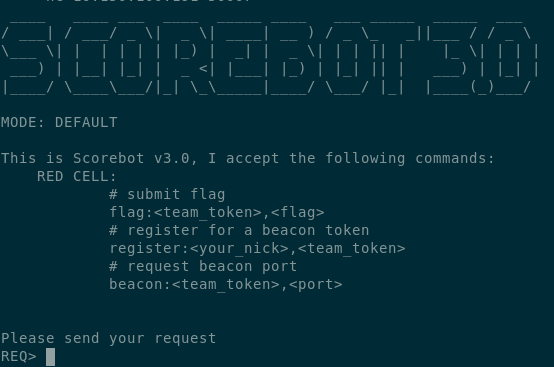

# Scorebot CLI server & Beacon server
Created Tuesday 28 November 2017

Setup
-----

### Dependencies

* python3
* pip
* scorebot api (<https://github.com/dichotomy/scorebot/tree/version3.0/Scorebot3>)

	git clone https://github.com/dichotomy/scorebot.git
	cd scorebot/CLI_BEACON_SERVER
	pip install -r requirements.txt

CLI server
----------

### Config setup
	{
		"url" : "<scorebot api url>",
		"key" : "<scorebot api access key>",
		"port": <listening port(has to be and integer)>,
		"host": "<listening address>",
		"mode": "default",
	}

### Usage
The cli server is the main way for players to interact with scorebot. It allows players to submit flag, register a beacon token, and open ports on the beacon server for beaconing. 

#### Run cli server
	cd scorebot/CLI_BEACON_SERVER
	python cli_server.py --config config.json

#### Interacting with cli server
You can connect to the cli server using netcat or other similar tools.
	nc <ip address> <port>

When you connect to the cli server you will see the following:

#### Submitting flags
Flags are pieces of data that you will find during the game. To submit a flag connect to scorebot using netcat and at the "REQ>" prompt type, flag:<your_token>,<flag>. If you are an offensive team in the game you will be provided a team token at the start of the game.
Here is an example of a successfull flag submission:

#### Register for a beacon token
In order to send a beacon to the beacon server you need to first register for a beacon token. To register a beacon token connect to scorebot using netcat and at the "REQ>" prompt type, register:<your_nickname>,<your_team_token>.
Here is an example of a successfull beacon token request:

#### Request a port to beacon to
Now that you have your beacon token your next step is to ask the cli server to open a port on the beacon server. Once you do this you can talk to the beacon server on the opened port to send your beacons. To request a beacon port connect to scorebot using netcat and at the "REQ>" prompt type, beacon:<team_token>,<port>.
Here is an example of a successfull beacon port request.

Beacon server
-------------

### Config setup
	{
	  "api": "<scorebot api url>",
	  "key": "<scorebot api access key>"
	}

### Usage
The beacon server is used a way for an attacker to let scorebot know that they can execute code on a compromised host. 
The attacker can do this by connecting to the beacon server on one of the opened ports and sending the beacon token they recieved when they registered with cli server.

#### Run beacon server
	cd scorebot/CLI_BEACON_SERVER
	python beacon_server.py --config beaconcfg.json

#### Interacting with beacon server
You can connect to the cli server using netcat or other similar tools.
	nc <ip address> <port>

#### Sending a beacon
Send a beacon is as simple as connecting to the beacon server using netcat and sending the beacon you recieved from the cli server.
Here is an example of send a beacon:

